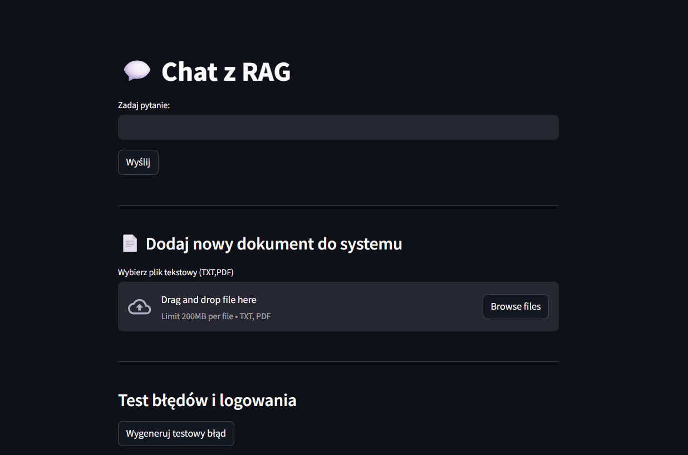
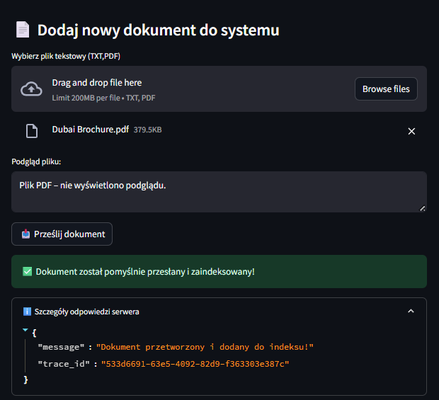
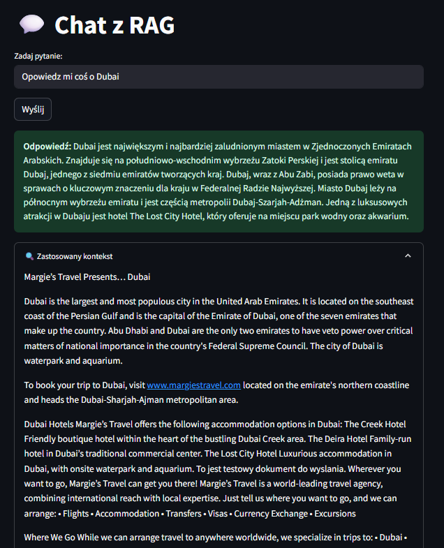
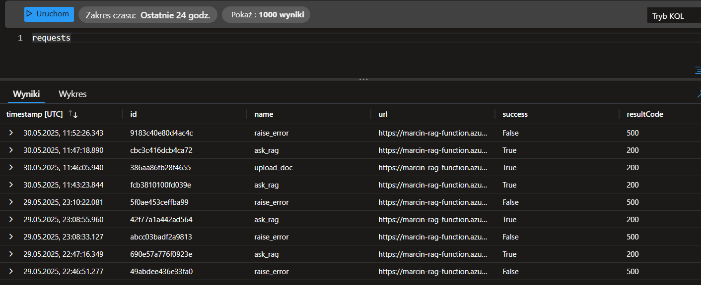
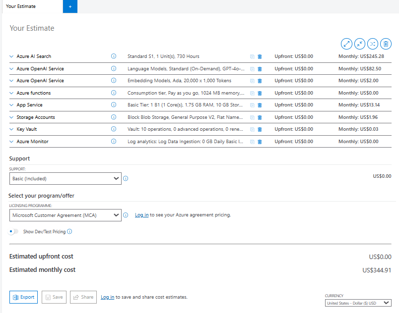

# Gen AI Trainee Project – Azure, LangChain & RAG


Welcome to the **Gen AI Trainee Project**! This repository is my comprehensive implementation and practical summary of the tasks performed during my Generative AI training program. This project is designed to provide a step-by-step journey into Gen AI, LangChain, Azure Functions, RAG (Retrieval-Augmented Generation) techniques, LLM, and **prompt engineering** through hands-on, micro-deliverable assignments.

The primary goal of this project is to showcase the practical application and integration of the latest AI technologies, including Microsoft Azure and popular libraries like LangChain. This repository offers insight into the process of building a real-world AI application, emphasizing not only the technical implementation but also the **art and science of crafting effective prompts** for large language models.

The repository follows the `src-layout` structure, with separate folders for each task/stage.

---

## 📁 Directory Structure

```bash
AI-TRAINEE-REPO/
├── assets/               
├── backlog/              
├── logs/                 
├── notebooks/            
├── prompts/              
├── src/
│   ├── Agents/           # LangGraph agents with Azure Content Safety, and blocked terms
│   ├── gpt_4o/           # Prompts + GPT-4o token usage logging
│   ├── HTTP_Trigger_app/ # Azure Functions: ask_rag, raise_error, upload_doc
│   ├── LangChain/        # LangChain-based experiments
│   ├── INVEST/           # User story generator with acceptance criteria
│   ├── quiz_bot/         # Prompt + CLI game
│   └── RAG_fundaments/   # Chunking, embedding, semantic search, indexing
```

---

## 🧠 Interactive RAG App built with LangChain + Azure + Streamlit

Below are screenshots illustrating the full working solution:

| Screenshot | Description |
|-----------|-------------|
|  | Main Streamlit UI – dashboard with options to run queries, upload documents, and trigger errors |
|  | Uploading new documents directly from the frontend to the RAG index |
|  | Query interface connected to the RAG pipeline (Streamlit → Azure Function → LangChain → Azure AI Search + LLM) |
|  | Button triggering a test exception that is logged with `logger.exception` and `traceId` in Azure Application Insights |
|  | Azure Application Insights logs showing function calls (`ask_rag`, `upload_doc`, `raise_error`) with traceability via `success`, `resultCode`, and `id` columns. Useful for debugging and end-to-end request tracking. |

---


### Estimation cost



The chart above presents the estimated monthly cost of running a production-ready Retrieval-Augmented Generation (RAG) system on Microsoft Azure. It includes all essential infrastructure components required for a startup-level deployment: GPT-4o language model, Ada embeddings, Azure AI Search (S1), Azure Functions for backend APIs, App Service (Linux) for hosting the frontend, Storage Account for document handling, and monitoring with Application Insights.

**Total estimated monthly cost: ~\$345**

---

## 🔐 Required Environment Variables (.env)

To run the application locally or in the cloud, create a `.env` file with the following variables:

<details>
<summary>Click to expand a sample `.env` file</summary>

```env
# Azure OpenAI
API_KEY=...
API_BASE=https://<your-endpoint>.openai.azure.com
API_VERSION=2025-01-01-preview
DEPLOYMENT_NAME=gpt-4o

# Embedding
DEPLOYMENT_NAME_FOR_EMBEDDINGS=text-embedding-ada-002
EMBEDDING_MODEL_NAME=text-embedding-ada-002

# Azure AI Search (vector index)
INDEX_NAME=index-marcin
URL_RAG=https://rag-marcin.search.windows.net
API_KEY_SEARCH=...

# Azure AI Search (semantic index)
INDEX_NAME_SEM=rag-marcin-sem
URL_RAG_SEM=https://rag-marcin-sem.search.windows.net
API_KEY_SEARCH_SEM=...

# Chat model
CHAT_DEPLOYMENT_NAME=gpt-4o
CHAT_MODEL_NAME=gpt-4o

# Azure Functions – HTTP Trigger endpoints
AZURE_FUNCTION_URL=https://<your-app>.azurewebsites.net/api/ask_rag
AZURE_FUNCTION_KEY=...

UPLOAD_FUNCTION_URL=https://<your-app>.azurewebsites.net/api/upload_doc
UPLOAD_FUNCTION_KEY=...

RAISE_ERROR_URL=https://<your-app>.azurewebsites.net/api/raise_error
RAISE_ERROR_KEY=...
```
</details>

---

## 🚀 How to Run Locally

```bash
# activate virtual environment
source venv312/bin/activate

# install dependencies
pip install -r requirements.txt

# run backend (Azure Function) or frontend (Streamlit)
func start                     # Azure Function
streamlit run src/HTTP_Trigger_app/frontend.py  # Streamlit app
```


