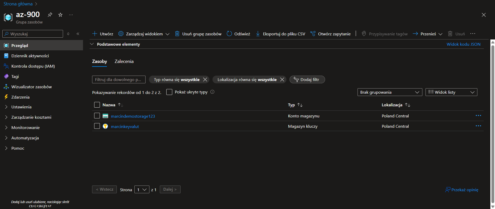

# Gen AI Trainee Project

## 📁 `src/` Directory Structure

The project follows a `src-layout` structure, allowing for a logical separation of modules and easier scalability in future weeks.

| Folder            | Contents and Purpose | Related Task |
|-------------------|----------------------|--------------|
| `gpt-4o/`          | Code for interacting with GPT-4o, executing 3 prompt tests, and logging token usage and costs to `/logs/usage.md`. | Deploy GPT-4o, run prompts, log usage |
| `INVEST/`          | Generator for INVEST-compliant user stories, with output saved to `/backlog/sprint1.md`. | Draft INVEST user stories |
| `quiz-bot/`        | Prompt and CLI game implemented in Python. | Craft a quiz-bot prompt, CLI game |
| `trainee_project/` | Base folder for initializing the repository, project structure, and environment setup. | Create GitHub repository & Python project structure |

---

## Week 1 – Azure & LLM Foundations (15 h)

### Tue 2 – Azure Resource Deployment

Below is the required screenshot showing the resource group successfully created in the Azure Portal:

The screenshot displays a resource group in the Azure portal, containing the created storage account (`marcindemostorage123`) and Key Vault (`marcinkeyvalut`).
