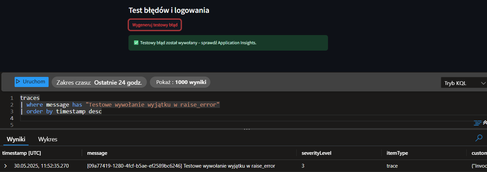

# Gen AI Trainee Project – Azure, LangChain & RAG

This project is a step-by-step training path covering Gen AI, LangChain, Azure Functions, and RAG (Retrieval-Augmented Generation) with hands-on micro-deliverables.

The repository follows the `src-layout` structure, with separate folders for each task/stage.

---

## 📁 Directory Structure

```bash
AI-TRAINEE-REPO/
├── assets/               
├── backlog/              
├── logs/                 
├── notebooks/            
├── prompts/              
├── src/
│   ├── gpt_4o/           # Prompts + GPT-4o token usage logging
│   ├── HTTP_Trigger_app/ # Azure Functions: ask_rag, raise_error, upload_doc
│   ├── LangChain/        # LangChain-based experiments
│   ├── INVEST/           # User story generator with acceptance criteria
│   ├── quiz_bot/         # Prompt + CLI game
│   └── RAG_fundaments/   # Chunking, embedding, semantic search, indexing
```

---

## 🧠 Interactive RAG App built with LangChain + Azure + Streamlit

Below are screenshots illustrating the full working solution:

| Screenshot | Description |
|-----------|-------------|
|  | Main Streamlit UI – dashboard with options to run queries, upload documents, and trigger errors |
|  | Uploading new documents directly from the frontend to the RAG index |
|  | Query interface connected to the RAG pipeline (Streamlit → Azure Function → LangChain → Azure AI Search + LLM) |
|  | Button triggering a test exception that is logged with `logger.exception` and `traceId` in Azure Application Insights |
|  | Azure Application Insights logs showing function calls (`ask_rag`, `upload_doc`, `raise_error`) with traceability via `success`, `resultCode`, and `id` columns. Useful for debugging and end-to-end request tracking. |

---

## 🔐 Required Environment Variables (.env)

To run the application locally or in the cloud, create a `.env` file with the following variables:

<details>
<summary>Click to expand a sample `.env` file</summary>

```env
# Azure OpenAI
API_KEY=...
API_BASE=https://<your-endpoint>.openai.azure.com
API_VERSION=2025-01-01-preview
DEPLOYMENT_NAME=gpt-4o

# Embedding
DEPLOYMENT_NAME_FOR_EMBEDDINGS=text-embedding-ada-002
EMBEDDING_MODEL_NAME=text-embedding-ada-002

# Azure AI Search (vector index)
INDEX_NAME=index-marcin
URL_RAG=https://rag-marcin.search.windows.net
API_KEY_SEARCH=...

# Azure AI Search (semantic index)
INDEX_NAME_SEM=rag-marcin-sem
URL_RAG_SEM=https://rag-marcin-sem.search.windows.net
API_KEY_SEARCH_SEM=...

# Chat model
CHAT_DEPLOYMENT_NAME=gpt-4o
CHAT_MODEL_NAME=gpt-4o

# Azure Functions – HTTP Trigger endpoints
AZURE_FUNCTION_URL=https://<your-app>.azurewebsites.net/api/ask_rag
AZURE_FUNCTION_KEY=...

UPLOAD_FUNCTION_URL=https://<your-app>.azurewebsites.net/api/upload_doc
UPLOAD_FUNCTION_KEY=...

RAISE_ERROR_URL=https://<your-app>.azurewebsites.net/api/raise_error
RAISE_ERROR_KEY=...
```
</details>

---

## 🚀 How to Run Locally

```bash
# activate virtual environment
source venv312/bin/activate

# install dependencies
pip install -r requirements.txt

# run backend (Azure Function) or frontend (Streamlit)
func start                     # Azure Function
streamlit run src/HTTP_Trigger_app/frontend.py  # Streamlit app
```

### Estimation cost


The chart above presents the estimated monthly cost of running a production-ready Retrieval-Augmented Generation (RAG) system on Microsoft Azure. It includes all essential infrastructure components required for a startup-level deployment: GPT-4o language model, Ada embeddings, Azure AI Search (S1), Azure Functions for backend APIs, App Service (Linux) for hosting the frontend, Storage Account for document handling, and monitoring with Application Insights.

**Total estimated monthly cost: ~\$345**


